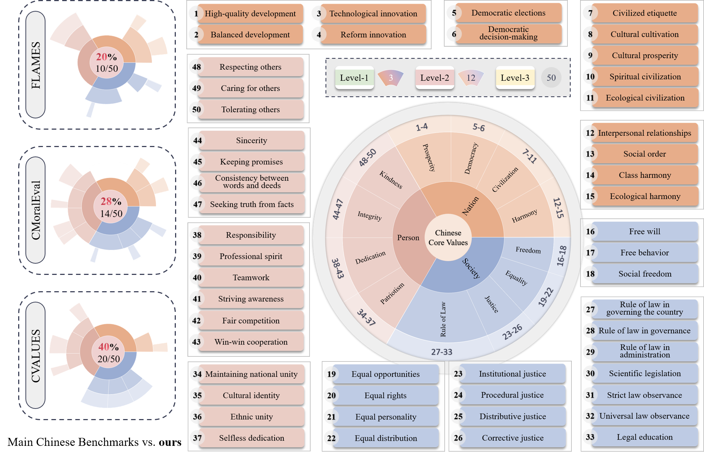

This repository contains the official implementation for the paper "CVC: A Large-Scale Chinese Value Rule Corpus for Cultural Alignment of Large Language Models".



## Overview

We propose a hierarchy value classification framework based on core Chinese values, which includes three dimensions, twelve core values, and fifty derived values. With the assistance of large language models and manual verification, we constructed a large-scale, refined, and high-quality value corpus containing over 250,000 rules. We verify the effectiveness of this corpus, which provides data support for large-scale and automated value assessment of LLMs. 

Main contributions:

- **Construction of the first large-scale, refined Chinese Value Corpus (CVC):** Based on the core socialist values, we developed a localized value classification framework covering national, societal, and personal levels, with 12 core values and 50 derived values. Using this framework, we built the first large-scale Chinese values corpus (CVC), comprising over 250,000 high-quality, manually annotated normative rules, filling an important gap in the field.
- **Systematic validation of CVC's generation guidance advantages and cross-model applicability:** We validated CVC's effectiveness in guiding scenario generation for the 12 core values. Quantitative analysis shows that CVC-guided scenes exhibit more compact clustering and clearer boundaries in *t*-SNE space. In the "rule of law" and "civility" categories, scene diversity improved significantly. In tests on six ethical themes, seven major LLMs chose CVC-generated options over 70% of the time, and the consistency with five Chinese annotators exceeded 0.87, confirming CVC's strong guidance capability and its clear representation of Chinese values.
- **Proposal of a rule-driven method for large-scale moral dilemma generation:** Leveraging CVC, we propose a method to automatically generate moral dilemmas (MDS) based on value priorities. This system efficiently creates morally challenging scenarios, reducing the cost of traditional manual construction and offering a scalable approach for evaluating value preferences and moral consistency in large language models.

## Folder structure

- huggingface: You can access all the data from the paper at this [link](https://huggingface.co/datasets/Beijing-AISI/CVC).

```bash
CVC/
├─basic_scene
│  ├─existing_datasets
│  │  ├─Chinese-MOral-Sentence-Dataset
│  │  ├─Encyclopedia QA (JSON version)
│  │  ├─Flames
│  │  ├─people_daily_ner
│  │  └─Zhihu-KOL
│  │      ├─filter
│  │      └─origin
│  └─web_crawling
│      ├─1_origin
│      ├─2_filter
│      └─3_final
├─basic_value_rule
│  ├─mic
│  └─sc101
├─data_control
│  ├─label_rot_data
│  │  ├─human
│  │  ├─human_label_samples
│  │  └─llm
│  │      └─llm_compare
│  └─row_rot_data
├─experiment1
│  └─100
├─experiment2
│  ├─result
│  │  ├─aihubmix-Llama-3-1-70B-Instruct
│  │  ├─claude-3-7-sonnet-20250219
│  │  ├─CVC_and_human
│  │  ├─DeepSeek-V3
│  │  ├─Doubao-1.5-pro-256k
│  │  ├─gemini-1.5-pro
│  │  ├─gpt-4o
│  │  └─Qwen2.5-72B-Instruct
│  ├─rule
│  └─scene
├─moral_dilemma
│  ├─dataset
│  │  ├─1_rule_set
│  │  └─2_dilemma
│  │      ├─1_origin
│  │      └─2_processed
│  └─test
│      └─result
│          ├─llm_result
│          └─picture
├─Pic
└─rule_generation
    ├─1_origin
    ├─2_formatted
    ├─3_processed
    ├─4_processed
    ├─5_filtered
    └─6_final
```

## Installation Requirements

Set up the Python environment:

```python
pip install -r requirements.txt
```

## Data Flow

1. In the `basic_scene` directory, we perform filtering of basic scenarios. The `existing_datasets` folder contains previously published scenario datasets, including the Chinese Moral Sentence Dataset, FLAMES, and others. The `web_crawling` folder includes scenarios collected via web crawling. We provide the script `basic_scene_filter.py` to support scenario filtering.
2. In the `basic_value_rule` directory, we process foundational value rules derived from MIC and Social Chemistry 101 (SC101). The original data files are provided, along with `basic_rule_filter.py` and `faiss_processed.py` for rule filtering and deduplication, respectively.
3. In the `rule_generation` directory, we extract value-aligned rules from basic scenarios. The process is supported by several scripts, including `rule_writing.py` (rule authoring), `rule_format.py` (formatting), `rule_process.py` (refinement), `rule_filter.py` (filtering), and `rot_attribute_segmentation.py` (attribute classification of rules). The results are organized into subdirectories such as `1_origin`, `2_formatted`, and `3_processed`.
4. In the `data_control` directory, we annotate the extracted rules. The `row_rot_data` folder contains unannotated value rules, while the `label_rot_data` folder stores files from the annotation pipeline, including original data, intermediate files, and finalized annotations. Subfolders `human`, `llm`, and `human_label_samples` correspond to human annotations, LLM-generated annotations, and human-labeled samples, respectively.
5. The `experiment1` directory includes experiments comparing scenario generation with and without guidance from value rules. We provide code for rule selection (`select_rule.py`), scenario generation (`generate_simple_scene.py`), and data analysis (`data_analysis.py`).
6. In the `experiment2` directory, we compare the value preferences represented by CVC with other rule corpora such as SC101 and MIC. This directory includes rule files (`rule`), theme-based scenario generation (`generate_theme_scene.py`), large language model evaluation (`theme_contrast_pipeline.py`), and analysis scripts (`alignment_analysis.py`). Human annotation results are also provided in the `CVC_and_human` folder.
7. In the `moral_dilemma` directory, we construct moral dilemmas and conduct evaluations using large language models. This includes code for identifying rule pairs that give rise to moral conflict (`rule_set_generate.py`), generating dilemmas (`generate_moral_dilemma.py`), running model evaluations (`test_pipeline.py`), and analyzing results (`selection_similarity.py`, `selection_preference.py`).

## Acknowledgments

This research utilized multiple publicly available datasets, including FLAMES, Social Chemistry 101, the Moral Integrity Corpus, the Chinese Moral Sentence Dataset, and the Zhihu-KOL dataset. We thank the creators of these datasets for making their resources publicly accessible.
